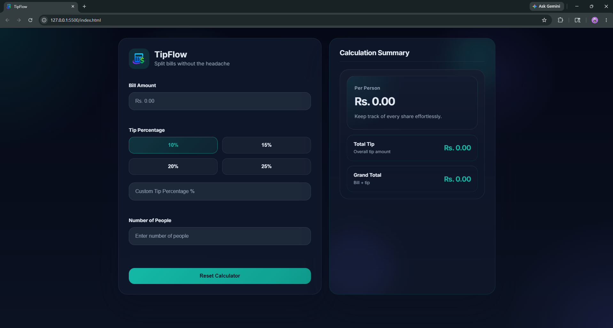

# 💸 TipFlow – Smart Tip Calculator & Bill Splitter

<table>
  <tr>
    <td width="40%">
      
    </td>
    <td width="60%">
      <strong>TipFlow</strong> is a responsive tip calculator and bill splitter built using <strong>HTML5</strong>, <strong>CSS3</strong>, and <strong>Vanilla JavaScript</strong>.  
      The application provides real-time calculations, smooth validation handling, responsive layouts, and an accessible user experience optimized for both desktop and mobile users.
    </td>
  </tr>
</table>

---

## ✨ Features

- 💸 **Real-Time Calculations** — Updates totals instantly while typing.
- 📱 **Responsive Layout** — Optimized for mobile, tablet, and desktop screens.
- ⚡ **Live Input Interaction** — No calculate button required.
- 🧾 **Inline Validation** — Error messages appear smoothly beside invalid inputs.
- 🎯 **Preset & Custom Tip Options** — Supports quick tip selection and custom percentages.
- 👥 **Per-Person Bill Splitting** — Dynamically calculates each person’s share.
- 🔄 **Reset Functionality** — Instantly clears all fields and resets the interface.
- ♿ **Accessibility-Friendly Design** — Semantic labels, visible focus states, and keyboard navigation support.
- 🎨 **Custom Branding** — Includes a custom TipFlow logo and favicon.

---

## 📂 Project Structure

```bash
tipflow-tip-calculator/
│
├── assets/
│   ├── logo.png
│   ├── favicon.png
│   ├── screenshot-desktop.png
│   └── screenshot-mobile.png
│
├── ANSWERS.md
├── README.md
├── index.html
├── script.js
└── style.css
```

---

## 🌐 Live Demo

👉 [View TipFlow Live](https://chalitha-wickramasingha.github.io/devweekends-tip-calculator/)

> Hosted using GitHub Pages.

---

## 📸 Screenshots

### 💻 Desktop View



### 📱 Mobile View


---

## 🛠️ Technologies Used

- **HTML5** — Semantic and accessible page structure.
- **CSS3** — Responsive styling using Flexbox, Grid, and media queries.
- **Vanilla JavaScript** — Dynamic calculations, validation, and interactivity.
- **Git & GitHub** — Version control and repository management.
- **GitHub Pages** — Deployment and live hosting.

---

## ⚙️ How to Run

### 🖥️ Run Locally

1. Clone or download this repository.
2. Open the project folder in a code editor.
3. Open `index.html` using any modern web browser.

No frameworks, package managers, or installations are required.

---

## 🎯 Core Functionalities

- Bill amount validation
- Preset tip percentage buttons
- Custom tip percentage input
- Dynamic total tip calculation
- Dynamic grand total calculation
- Dynamic per-person calculation
- Inline validation feedback
- Responsive mobile-first layout
- Keyboard-accessible interaction flow
- Reset button functionality

---

## 👨‍💻 Author

**Chalitha Wickramasingha**

🔗 GitHub: https://github.com/chalitha-wickramasingha  
🔗 LinkedIn: https://www.linkedin.com/in/chalitha-t-wickramasingha

---

> 💸 Built for the Dev Weekends Fellowship 2026 Frontend Assessment.
